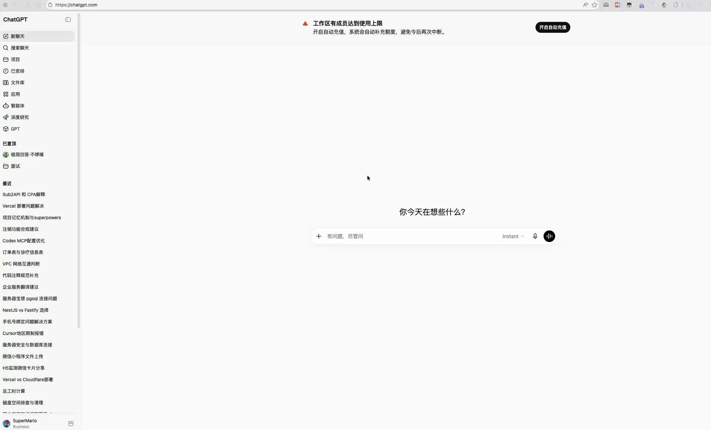

## web-session-copier

一个用于**复制并应用 Web 会话数据**（Cookies、LocalStorage、SessionStorage）的浏览器扩展，面向多账号/多环境/联调等需要频繁切换登录态的场景。

### 为什么做 / 解决什么痛点
- **免密码共享**：可将会话数据以 JSON 形式分享给其他朋友/同事，用于联调或复现问题（分享的是登录态，不是密码）
- **省时间**：反复登录、开无痕、切账号、切环境很耗时
- **降出错**：手动拷贝 Cookie/Storage 容易遗漏、属性不匹配导致“写了但没生效”
- **好排查**：SameSite/secure/HttpOnly/隐私策略等限制经常导致写入被丢弃，不容易定位

### 优势
- **轻权限**：默认不强依赖 `chrome.cookies` 权限，主要通过页面上下文的 `document.cookie` 与脚本注入覆盖大多数同域/子域写入场景
- **策略清晰**：内置同域/跨域写入策略 + 状态反馈（成功/失败摘要与建议操作），减少排查成本
- **调试友好**：支持对比“按 URL / 按 Domain”两种 Cookie 读取方式的数量与 HttpOnly 统计，便于快速定位问题

### 下载
- [下载最新 Release（zip）](https://github.com/justwe7/web-session-copier/releases/latest)
- [查看所有 Releases](https://github.com/justwe7/web-session-copier/releases)

### 演示


## 核心功能
- 复制会话到剪贴板：读取当前标签页的会话数据（含 Cookies、LocalStorage、SessionStorage）并以 JSON 复制。
- 应用会话到当前站点：将剪贴板中的会话写回当前站点。
- 跨域写入策略：
  - 同域：来源域与当前域相同或满足父/子域关系时，尽可能保留原有 Cookie 属性。
  - 跨域：来源域与当前域不同，Cookies 与 Storage 仅落在“当前域”，不做跨站强写。
- 即时反馈：通过 `StatusBar` 在 UI 展示“同域/跨域”写入类型、成功/失败摘要与建议操作（如刷新页面）。
- 调试工具：一键对比“按 URL”与“按 Domain”两种方式读取到的 Cookies 数量与 HttpOnly 统计，并输出完整明细，便于排查。

## 工作方式（简述）
1) 读取
   - Cookies：优先按当前标签页 `url` 读取（可统计到 HttpOnly），若为空再按 `domain` 回退。
   - Storage：通过脚本注入读取 `localStorage` 与 `sessionStorage`。
2) 写入（默认无权限模式）
   - Cookies：在页面上下文使用 `document.cookie` 写入，支持 `path`、`expires`、`samesite`、`secure(https)`；不支持 HttpOnly 设置；不可跨站设置。
   - Storage：在页面上下文直接写入 `localStorage`、`sessionStorage`。
3) 写入策略判定
   - `sameDomain`：来源与目标满足相同/父子域关系→尽量保留域路径属性（若不匹配则跳过避免跨站失败）。
   - `crossDomain`：一律落到当前域，不附加原 `domain` 属性。

## 限制与边界
- 无法设置或读取 HttpOnly（仅 `document.cookie` 模式）；若需写入 HttpOnly，需启用 `chrome.cookies` 权限并使用增强 API（本项目已留有实现但默认不启用）。
- 不能跨站设置 Cookies（不同 eTLD+1）。
- `secure` 仅在 https 页面生效；严格的 SameSite、分区/第三方 Cookie、容器/隐私策略可能导致写入被丢弃。

This is a [Plasmo extension](https://docs.plasmo.com/) project bootstrapped with [`plasmo init`](https://www.npmjs.com/package/plasmo).

## Getting Started

First, run the development server:

```bash
pnpm dev
# or
npm run dev
```

## Making production build

Run the following:

```bash
pnpm build
# or
npm run build
```

## Submit to the webstores

The easiest way to deploy your Plasmo extension is to use the built-in [bpp](https://bpp.browser.market) GitHub action. Prior to using this action however, make sure to build your extension and upload the first version to the store to establish the basic credentials. Then, simply follow [this setup instruction](https://docs.plasmo.com/framework/workflows/submit) and you should be on your way for automated submission!
