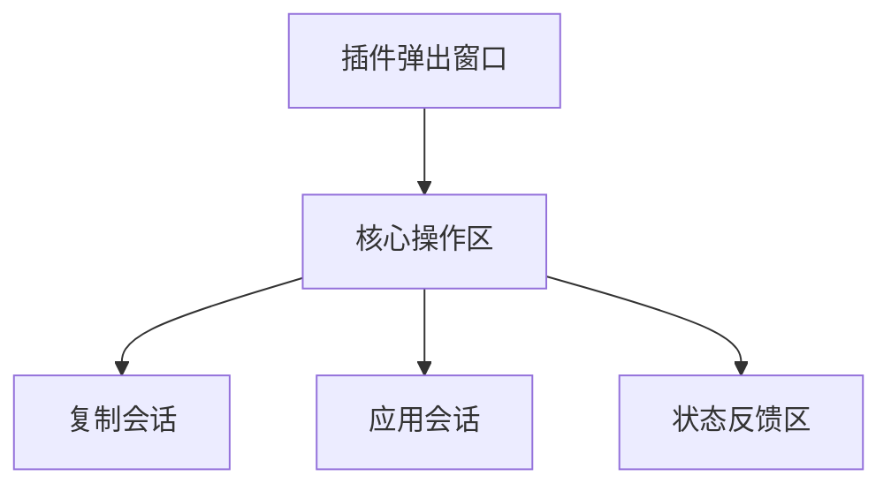

# 信息架构

## 站点地图 / 界面清单

由于这是一个功能高度聚焦的工具，其界面架构极其简单，仅包含一个核心界面。

## 导航结构

### 主导航 (Primary Navigation)
不适用。本插件仅由一个无导航的单一视图构成。

### 次级导航 (Secondary Navigation)
不适用。

### 面包屑 (Breadcrumb Strategy)
不适用。

## 核心界面布局

### 界面名称: 插件弹出窗口 (Extension Popup)

**目的**: 为用户提供"复制"和"应用"会话的核心功能，并给予清晰的操作反馈。

### 关键元素:

1. **标题**: "Incognito Session Copier"

2. **主操作区**:
   - 一个清晰的主按钮: "Copy Session"
   - 另一个同样清晰的主按钮: "Apply Session"

3. **状态反馈区**: 默认隐藏，在用户操作后显示反馈信息（如"复制成功！"）。

4. **(可选建议)**: 一个小问号图标或"帮助"链接，点击后可显示关于安全风险和使用方法的简短说明。

### 交互说明:

- 按钮应有明确的悬停（hover）和点击（active）状态。
- 点击按钮后，应有短暂的加载状态，然后显示成功或失败的信息。
- 状态反馈信息可以使用颜色进行区分（如绿色代表成功，红色代表失败）。
